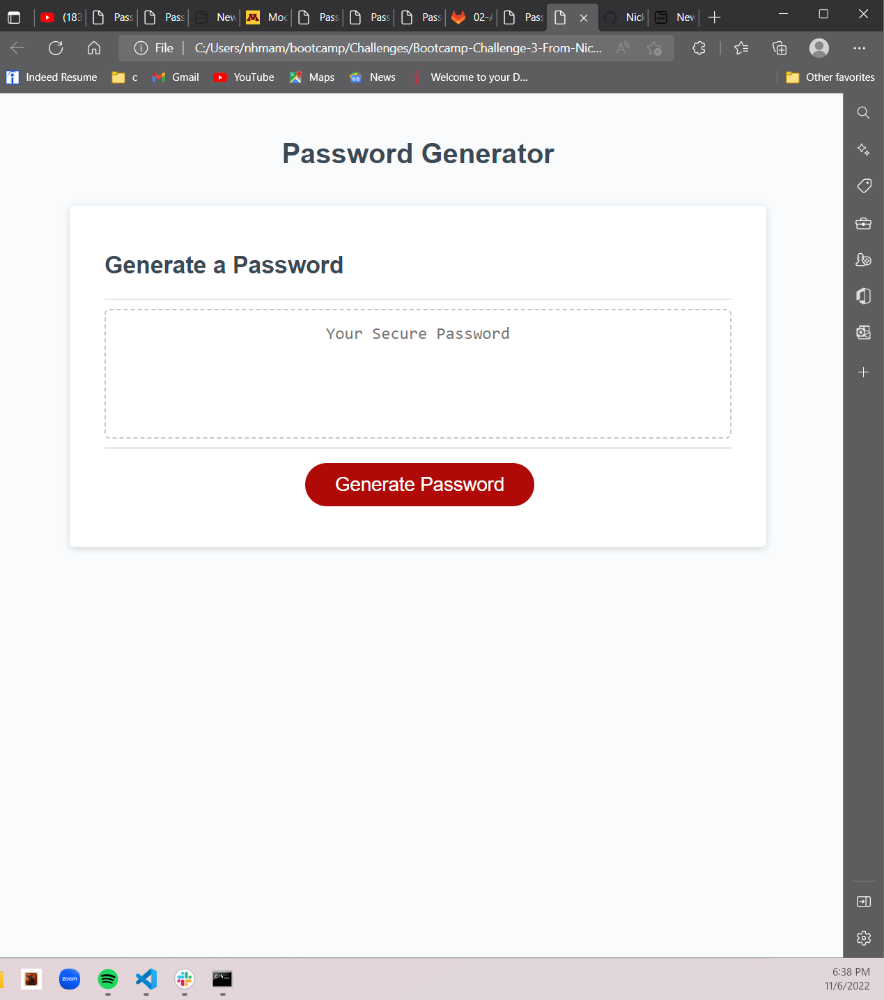

# Unique-Password-Generator

## Description
The motivation behind this project was to get a better handle of using javascript to create something semi-useful with what we have learned.

This project was made to create a unique password generator for the user to create their own password in several ways using either symbols, numbers, lower case letters, and/or uppercase letters.They can then copy the password and use it at their own discretion.

In turn, this project solves the problem of thinking of a unique password for different websites and accurately fits the needs of modern websites by following criteria such as using, uppercase letters, lowercase letters, special characters, and numbers in a given password.

I learned about how to use the proper ways to use functions, methods, else if statements, loops, and more methodologies from javascript in order to create an application for use and to solve every type of user input into an application. If the user found a way to break the application it would not seem that useful.

## Table of Contents

- [Description](#description)
- [Installation](#installation)
- [Usage](#usage)
- [Credits](#credits)
- [License](#license)

## Installation

Enter the URL from the website. My website:https://nickhm05.github.io/Unique-Password-Generator/

URL of the github repository:https://github.com/NickHM05/Unique-Password-Generator
## Usage

## Credits

-Collaborators:
- Nicholas Mamberger (author) https://github.com/NickHM05
- Miguel Montenegro https://github.com/Darkunitx
- Salahuddin Imdad https://github.com/Sal8298

Resource used: Tutorials from SoloLearn app and class activities. Mdn website was used for some unique code as well.

## License

MIT License

 Copyright (c) [2022] [Nicholas Mamberger]

Permission is hereby granted, free of charge, to any person obtaining a copy
of this software and associated documentation files (the "Software"), to deal
in the Software without restriction, including without limitation the rights
to use, copy, modify, merge, publish, distribute, sublicense, and/or sell
copies of the Software, and to permit persons to whom the Software is
furnished to do so, subject to the following conditions:

The above copyright notice and this permission notice shall be included in all
copies or substantial portions of the Software.

THE SOFTWARE IS PROVIDED "AS IS", WITHOUT WARRANTY OF ANY KIND, EXPRESS OR
IMPLIED, INCLUDING BUT NOT LIMITED TO THE WARRANTIES OF MERCHANTABILITY,
FITNESS FOR A PARTICULAR PURPOSE AND NONINFRINGEMENT. IN NO EVENT SHALL THE
AUTHORS OR COPYRIGHT HOLDERS BE LIABLE FOR ANY CLAIM, DAMAGES OR OTHER
LIABILITY, WHETHER IN AN ACTION OF CONTRACT, TORT OR OTHERWISE, ARISING FROM,
OUT OF OR IN CONNECTION WITH THE SOFTWARE OR THE USE OR OTHER DEALINGS IN THE
SOFTWARE.